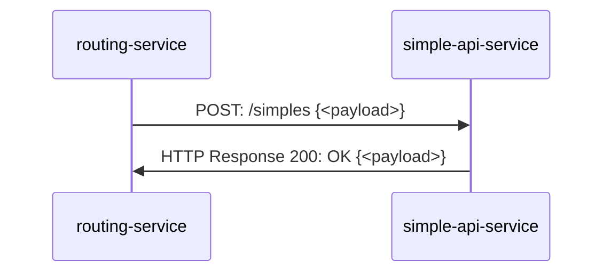
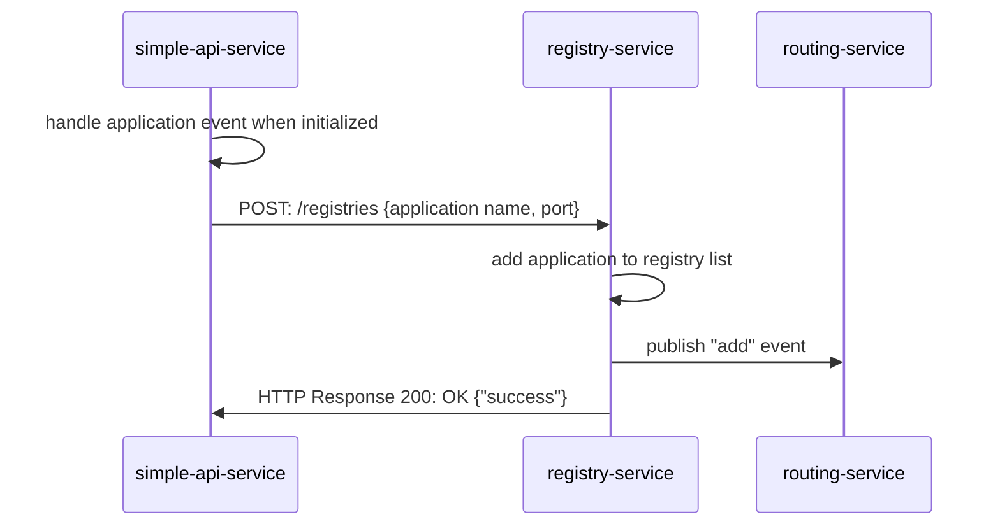

# simple-api-service
Simple API Service for handling simple HTTP request, consisting of 2 modules: simple and registry.   

### Simple Module
Handle HTTP request for Simple API

### Registry Module
Handle logic to register the **simple-api-service** to **registry-service**

 

## System Flow
### Handle /simples HTTP request

### Register service to registry

For more information on other flows and services, see also [registry-service](https://github.com/punyisakra/registry-service) and [routing-service](https://github.com/punyisakra/routing-service)
